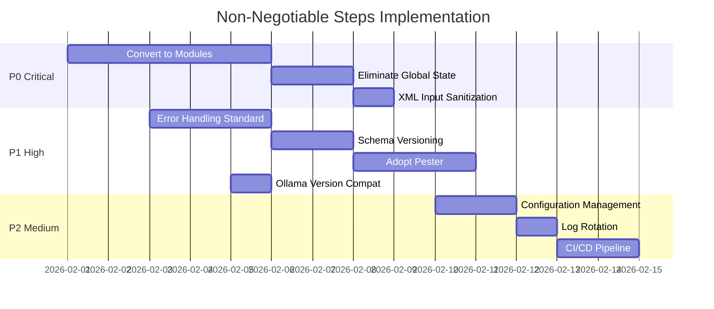

# Analysis on Immediate Non-Negotiable Steps

## Overview

This document identifies **critical gaps and technical debt** that should be addressed immediately to ensure the project's stability, maintainability, and future scalability. These are not feature requests—they are foundational improvements that will prevent problems as the codebase grows.

---

## Priority Matrix

| Priority  | Category | Impact if Ignored                          |
| --------- | -------- | ------------------------------------------ |
| 🔴 **P0** | Critical | System instability, data loss risk         |
| 🟠 **P1** | High     | Development friction, debugging difficulty |
| 🟡 **P2** | Medium   | Code quality degradation over time         |

---

## 🔴 P0: Critical Items

### 1. Convert from Dot-Sourcing to Proper PowerShell Modules

**Current State:**
All scripts use dot-sourcing (`. .\SomeFile.ps1`) for dependency loading. Each script re-loads all dependencies, causing:

- Performance overhead
- Potential state contamination
- No version control over dependencies

**Non-Negotiable Action:**

```powershell
# Convert this pattern:
. "$PSScriptRoot\ConsoleUtils.ps1"
. "$PSScriptRoot\DateTimeUtils.ps1"

# To proper module manifest:
# LocalRagUtils.psd1
@{
    ModuleVersion = '2.1.0'
    RootModule = 'LocalRagUtils.psm1'
    FunctionsToExport = @('Write-Header', 'Get-Timestamp', ...)
    RequiredModules = @()
}
```

**Why Non-Negotiable:**

- PowerShell modules are the supported dependency mechanism
- Enables proper versioning and distribution
- Prevents accidental global state pollution

---

### 2. Eliminate Global State

**Current State:**

```powershell
# Schemas.ps1
$Global:SchemaRegistry = [SchemaRegistry]::new()
```

**Risk:** Any script can modify the global registry, causing unpredictable behavior.

**Non-Negotiable Action:**
Replace global singleton with dependency injection:

```powershell
# Instead of global access
$registry = $Global:SchemaRegistry

# Inject via constructor or parameter
function Parse-XMLFile {
    param(
        [string]$FilePath,
        [SchemaRegistry]$Registry = (Get-DefaultSchemaRegistry)
    )
}
```

---

### 3. Add Input Sanitization for XML Output

**Current State:**
XML logging directly embeds user data without escaping:

```powershell
# XMLLogger.ps1 - line 127
$propElement.InnerText = $value.ToString()
```

**Risk:** If `$value` contains characters like `<`, `>`, or `&`, the XML becomes malformed.

**Non-Negotiable Action:**

```powershell
# Use proper XML text handling
$propElement.InnerText = [System.Security.SecurityElement]::Escape($value.ToString())
# OR use XmlDocument's built-in escaping methods
```

---

## 🟠 P1: High Priority Items

### 4. Implement Proper Error Handling in Critical Paths

**Current Pattern:**

```powershell
try {
    # operation
} catch {
    Write-Warning "Failed: $($_.Exception.Message)"
    return $false
}
```

**Problem:** Errors are swallowed, making debugging difficult.

**Non-Negotiable Action:**
Create an error handling standard:

```powershell
try {
    # operation
} catch {
    $errorDetails = @{
        Operation = "XMLParsing"
        File = $filePath
        Error = $_.Exception.Message
        StackTrace = $_.ScriptStackTrace
        Timestamp = Get-Date -Format "o"
    }

    # Log structured error
    $errorManager.AddError("PARSING", $filePath, $_.Exception.Message, "ParseXML", $errorDetails)

    # Re-throw if critical, otherwise return structured failure
    throw [System.IO.InvalidDataException]::new("XML parsing failed for $filePath", $_)
}
```

---

### 5. Add Schema Versioning

**Current State:**
Schemas are defined inline with no version tracking:

```powershell
$this.RegisterSchema("PowerShellLog", @{
    "rootElement" = "PowerShellLog"
    # ...
})
```

**Risk:** Schema changes break parsing of older log files.

**Non-Negotiable Action:**

```powershell
$this.RegisterSchema("PowerShellLog", @{
    "version" = "1.0"
    "rootElement" = "PowerShellLog"
    "migrationPath" = $null  # or reference to migration script
    "deprecationDate" = $null
})

# In XML output
<PowerShellLog schemaVersion="1.0" ...>
```

---

### 6. Formalize Test Runner

**Current State:**
Tests are standalone scripts that must be manually executed:

- `Full-System-Test.ps1`
- `Test-DataProcessor.ps1`
- `Test-ExecutionContext.ps1`

**Non-Negotiable Action:**
Adopt Pester (PowerShell's standard testing framework):

```powershell
# Install Pester
Install-Module -Name Pester -Force -Scope CurrentUser

# Convert tests to Pester format
Describe "XMLLogger" {
    It "should create valid XML log file" {
        $logger = [XMLLogger]::NewForOperation("test", "UnitTest")
        $logger.LogInfo("TEST", "Test message")
        $logger.SaveLog()

        Test-Path $logger.LogFile | Should -Be $true
        [xml](Get-Content $logger.LogFile) | Should -Not -BeNullOrEmpty
    }
}
```

---

### 7. Document Ollama Version Compatibility

**Current State:**
`ModelUtils.ps1` parses Ollama output using regex:

```powershell
if ($line -match '^(\S+)\s+([a-f0-9]+)\s+(\d+\.?\d*\s*[KMGT]?B)\s+(.+)$') {
```

**Risk:** Ollama CLI output format may change between versions.

**Non-Negotiable Action:**

1. Document tested Ollama versions in README
2. Add version detection:

```powershell
[string] GetOllamaVersion() {
    $versionOutput = ollama version 2>&1
    if ($versionOutput -match 'version\s+([\d.]+)') {
        return $matches[1]
    }
    return "unknown"
}
```

3. Add warning for untested versions

---

## 🟡 P2: Medium Priority Items

### 8. Create Configuration Management

**Current State:**
Hardcoded values throughout:

```powershell
# PathUtils.ps1
$Global:ProjectRoot = Split-Path -Parent (Split-Path -Parent $PSScriptRoot)
$Global:LogsDir = Join-Path $Global:ProjectRoot "Logs"
```

**Non-Negotiable Action:**
Create centralized configuration:

```powershell
# config/project-config.psd1
@{
    Paths = @{
        LogsDirectory = "Logs"
        ReportsDirectory = "Logs/Reports"
        HtmlDirectory = "html_pages"
    }
    Logging = @{
        DefaultLevel = "INFO"
        MaxFileSize = 10MB
        RetentionDays = 30
    }
    Ollama = @{
        MinSupportedVersion = "0.12.0"
        ServiceTimeout = 30
    }
}

# Load via
$config = Import-PowerShellDataFile "$PSScriptRoot/config/project-config.psd1"
```

---

### 9. Add Log Rotation

**Current State:**
Logs accumulate indefinitely in `Logs/` directory. Currently 43+ files exist.

**Non-Negotiable Action:**
Implement rotation in `PathUtils.ps1`:

```powershell
function Invoke-LogRotation {
    param(
        [int]$RetentionDays = 30,
        [long]$MaxTotalSize = 100MB
    )

    $oldFiles = Get-ChildItem $Global:LogsDir -File |
        Where-Object { $_.LastWriteTime -lt (Get-Date).AddDays(-$RetentionDays) }

    foreach ($file in $oldFiles) {
        Remove-Item $file.FullName -Force
        Write-Verbose "Rotated: $($file.Name)"
    }
}
```

---

### 10. Add CI/CD Pipeline Definition

**Current State:**
`.github/` directory exists but contents not examined. No automated testing evident.

**Non-Negotiable Action:**
Create minimal GitHub Actions workflow:

```yaml
# .github/workflows/test.yml
name: PowerShell Tests

on: [push, pull_request]

jobs:
  test:
    runs-on: windows-latest
    steps:
      - uses: actions/checkout@v4

      - name: Install Pester
        shell: pwsh
        run: Install-Module -Name Pester -Force -Scope CurrentUser

      - name: Run Tests
        shell: pwsh
        run: |
          cd "PowerShell Scripts"
          Invoke-Pester -Path . -Output Detailed -CI
```

---

## Implementation Order



---

## Summary Checklist

| #   | Item                          | Priority | Effort | Impact   | Status     |
| --- | ----------------------------- | -------- | ------ | -------- | ---------- |
| 1   | Convert to PowerShell Modules | 🔴 P0    | High   | Critical | ⏳ Planned |
| 2   | Eliminate Global State        | 🔴 P0    | Medium | Critical | ✅ Done    |
| 3   | XML Input Sanitization        | 🔴 P0    | Low    | Critical | ✅ Done    |
| 4   | Standardize Error Handling    | 🟠 P1    | Medium | High     | ✅ Done    |
| 5   | Schema Versioning             | 🟠 P1    | Medium | High     | ✅ Done    |
| 6   | Adopt Pester Testing          | 🟠 P1    | High   | High     | ✅ Done    |
| 7   | Document Ollama Compatibility | 🟠 P1    | Low    | Medium   | ✅ Done    |
| 8   | Configuration Management      | 🟡 P2    | Medium | Medium   | ✅ Done    |
| 9   | Implement Log Rotation        | 🟡 P2    | Low    | Medium   | ✅ Done    |
| 10  | Add CI/CD Pipeline            | 🟡 P2    | Medium | Medium   | ✅ Done    |

> [!NOTE]
> **Progress Update (2026-01-29):** Items 2-10 completed. 73 Pester tests passing. CI/CD with GitHub Actions. Remaining: Module conversion (1).
