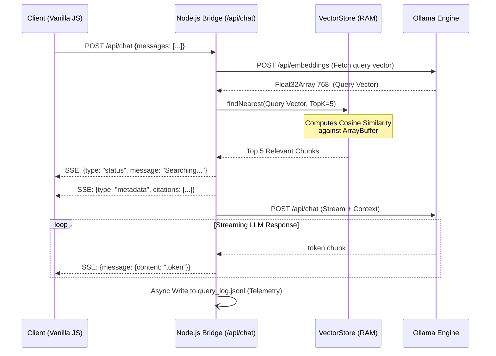
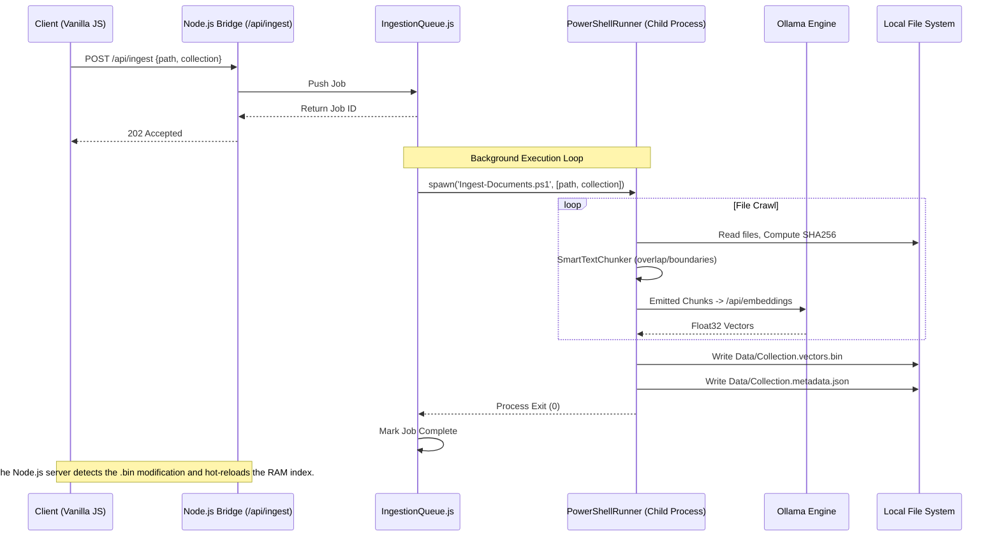

# Architecture Design

## 1. System Overview

The Local RAG (Retrieval-Augmented Generation) Project v2 utilizes a **Hybrid Multi-Tier Architecture**, combining the rapid, scriptable system access of PowerShell with the high-performance, asynchronous networking capabilities of Node.js.

The system is designed to run 100% locally, with zero internet dependencies, ensuring complete data privacy. It leverages Ollama as the underlying local LLM engine for both embeddings and chat generation.

---

## 2. The Three Tiers

The application is strictly separated into three concerns:

### Tier 1: Client (Presentation Layer)

- **Technology:** Vanilla HTML, CSS, and modular JavaScript (`type="module"`).
- **Rationale:** Zero build-step complexity. Extremely lightweight footprint. No heavy frameworks (React/Vue) translates to instant browser rendering.
- **Responsibilities:**
  - Rendering the chat UI and streaming reasoning/response tokens.
  - Managing the ingestion queue UI and polling status.
  - Parsing active Server-Sent Events (SSE) from the Node.js bridge.

### Tier 2: Bridge Server (Middleware & Hot Path)

- **Technology:** Node.js (Express), ES Modules.
- **Rationale:** PowerShell possesses significant cold-start latency (2-5 seconds). Node.js maintains objects in memory instantly, providing real-time UI responsiveness and managing parallel background processes seamlessly.
- **Responsibilities:**
  - **Hot Path Querying:** Directly calculates cosine similarities against `Float32Array` buffers in memory and streams LLM responses via generic `fetch`.
  - **Process Management:** Spawns and monitors background PowerShell instances for heavy, synchronous tasks (like offline folder vectorization).
  - **Telemetry:** Asynchronously writes pipeline logging (`query_log.jsonl`) without blocking the event loop.

### Tier 3: Core Engine (Heavy Processing Layer)

- **Technology:** PowerShell 7+ (Object-Oriented/Class-based).
- **Rationale:** Deep system-level access. Unrestricted file system crawling. Excellent string manipulation for smart text chunking.
- **Responsibilities:**
  - Crawling local directories and computing `SHA256` content hashes.
  - Semantic chunking (markdown, code elements, text windows) via `SmartTextChunker.ps1`.
  - Writing the highly-optimized `.vectors.bin` binary store to disk.

---

## 3. Data Flow Diagrams

### Diagram A: The Read Path (Chat & Retrieval)

_This is the "Hot Path". Note that PowerShell is entirely excluded from this flow to achieve zero-latency responses._

### Diagram B: The Write Path (Data Ingestion)

_This is the "Cold Path". Background jobs are managed via a local JSON queue, allowing heavy synchronous operations to run without blocking the UI._

---

## 4. Storage Architecture

To ensure speed and portability, the RAG engine avoids heavy external databases (like SQLite or PostgreSQL) in favor of a tightly optimized, dual-file architecture per collection.

### 1. `CollectionName.vectors.bin`

A raw binary payload designed to map instantly into memory (`Buffer` / `Float32Array`).

- **Header:** Contains Vector Count (Int32), Dimensions (Int32), and the Embedded Model Name (Length-prefixed UTF-8 string, e.g., `nomic-embed-text`) to prevent dimension-mismatch corruption.
- **Body:** Sequential 32-bit floats. At 768 dimensions, 10,000 vectors consume only ~30MB of RAM.

### 2. `CollectionName.metadata.json`

An array of objects corresponding 1:1 with the indices in the binary file.

- **Fields:** `FileName`, `ChunkIndex`, `ChunkText`, `TextPreview`, `HeaderContext`, `Source`.
- Storing the full raw text alongside the vector allows exact 1:1 prompt reconstruction during the chat phase without needing to fetch the original documents from the filesystem.

### 3. `CollectionName.manifest.json`

A state-tracking ledger for ingestion optimization.

- Stores `SHA256` hashes of original files.
- Prevents re-vectorizing files that haven't changed, reducing ingestion time on large directories from minutes to milliseconds.
