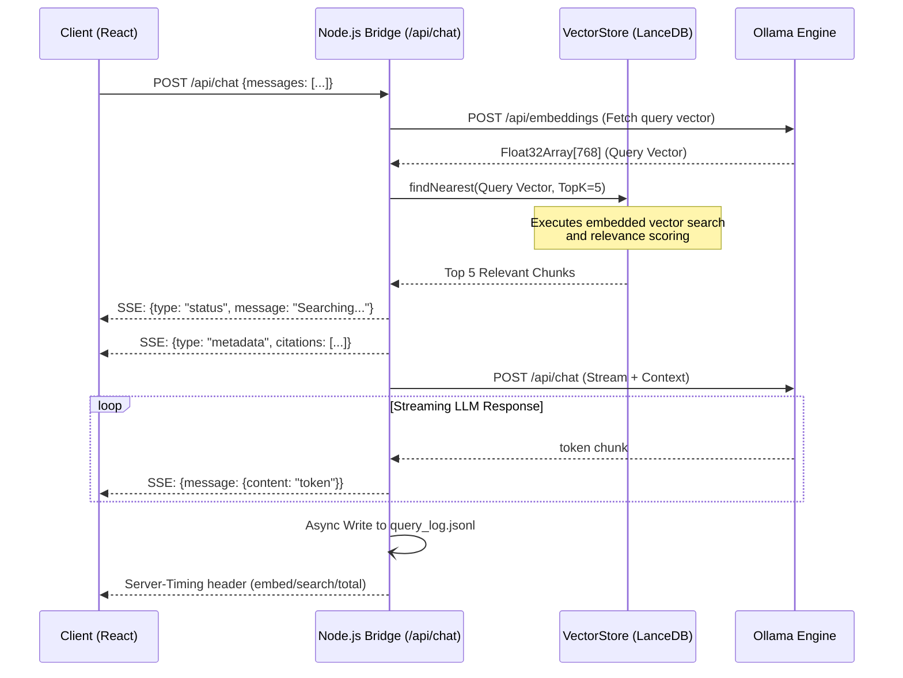
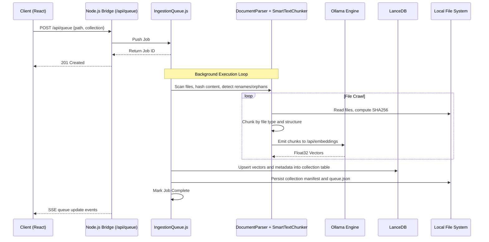

# Architecture Design

## 1. System Overview

The Local RAG (Retrieval-Augmented Generation) Project v2 utilizes a **Hybrid Multi-Tier Architecture** built around a Node.js runtime for the live application path, a React client for the local UI, and PowerShell utilities for offline diagnostics, reporting, and operational tooling.

The system is designed to run 100% locally, with zero internet dependencies, ensuring complete data privacy. It leverages Ollama as the underlying local LLM engine for both embeddings and chat generation.

---

## 2. The Three Tiers

The application is strictly separated into three concerns:

### Tier 1: Client (Presentation Layer)

- **Technology:** React, Vite.
- **Rationale:** Managing complex UI states, active Server-Sent Events (SSE), queue updates, health polling, and LLM reasoning processes in real-time benefits from a declarative framework and predictable component model.
- **Responsibilities:**
  - Rendering the chat UI and streaming reasoning/response tokens.
  - Managing the ingestion queue UI and polling operational status.
  - Displaying health and vector index state from the bridge server.
  - Parsing active Server-Sent Events (SSE) from the Node.js bridge.

### Tier 2: Bridge Server (Middleware & Hot Path)

- **Technology:** Node.js (Express), ES Modules.
- **Rationale:** PowerShell possesses significant cold-start latency for user-facing request paths. Node.js maintains application state in memory, serves HTTP/SSE traffic efficiently, and now owns the primary runtime workflow for both chat and ingestion orchestration.
- **Responsibilities:**
  - **Hot Path Querying:** Embeds prompts, queries LanceDB, and streams LLM responses over SSE.
  - **Ingestion Orchestration:** Manages queue state, document scanning, chunking, embedding, and LanceDB writes through the native Node ingestion pipeline.
  - **Operational APIs:** Serves `/api/health`, `/api/index/metrics`, `/api/models`, `/api/queue`, and `/api/log`.
  - **Observability:** Asynchronously writes query telemetry to `logs/query_log.jsonl`, emits `Server-Timing` headers for chat requests, and appends bridge XML logs for UI-originated events.

### Tier 3: Utility and Diagnostics Layer

- **Technology:** PowerShell 7+ (Object-Oriented/Class-based).
- **Rationale:** PowerShell remains valuable for local diagnostics, structured XML logging, report generation, model checks, and scriptable system-level utilities.
- **Responsibilities:**
  - Executing offline or maintenance-focused workflows such as model checks and report generation.
  - Producing structured XML execution logs through `XMLLogger.ps1` and `ExecutionContext.ps1`.
  - Supporting local analysis and diagnostics without sitting on the primary request path.

## 2.5. Observability Surfaces

The current runtime exposes several local observability surfaces:

- `logs/query_log.jsonl` for chat-query telemetry and retrieval results.
- `PowerShell Scripts/Data/bridge-log.xml` for bridge and UI-originated XML log entries.
- PowerShell XML execution logs under `logs/` for script-level diagnostics.
- `/api/health` for cached local dependency and disk readiness checks.
- `/api/index/metrics` for vector index state and coarse collection health.
- `Server-Timing` headers on `/api/chat` for embed, search, and total request timing.

See `docs/Observability_Analysis.md` for the deeper assessment of strengths, gaps, and recommended follow-up work.

---

## 3. Data Flow Diagrams

### Diagram A: The Read Path (Chat & Retrieval)

_This is the "Hot Path". Note that PowerShell is entirely excluded from this flow to achieve zero-latency responses._

```mermaid
sequenceDiagram
    participant UI as Client (React)
    participant Node as Node.js Bridge (/api/chat)
    participant VStore as VectorStore (LanceDB)
    participant Ollama as Ollama Engine

    UI->>Node: POST /api/chat {messages: [...]}
    Node->>Ollama: POST /api/embeddings (Fetch query vector)
    Ollama-->>Node: Float32Array[768] (Query Vector)

    Node->>VStore: findNearest(Query Vector, TopK=5)
    Note over VStore: Executes embedded vector search<br/>and relevance scoring
    VStore-->>Node: Top 5 Relevant Chunks

    Node-->>UI: SSE: {type: "status", message: "Searching..."}
    Node-->>UI: SSE: {type: "metadata", citations: [...]}

    Node->>Ollama: POST /api/chat (Stream + Context)

    loop Streaming LLM Response
        Ollama-->>Node: token chunk
        Node-->>UI: SSE: {message: {content: "token"}}
    end

    Node-)Node: Async Write to query_log.jsonl
    Node-->>UI: Server-Timing header (embed/search/total)
```

### Diagram B: The Write Path (Data Ingestion)

_This is the background ingestion path. Jobs are managed through a durable local queue and processed natively in Node.js without blocking the chat path._

```mermaid
sequenceDiagram
    participant UI as Client (React)
    participant Node as Node.js Bridge (/api/queue)
    participant Queue as IngestionQueue.js
    participant Parser as DocumentParser + SmartTextChunker
    participant Ollama as Ollama Engine
    participant DB as LanceDB
    participant Disk as Local File System

    UI->>Node: POST /api/queue {path, collection}
    Node->>Queue: Push Job
    Queue-->>Node: Return Job ID
    Node-->>UI: 201 Created

    Note over Queue, Parser: Background Execution Loop
    Queue->>Parser: Scan files, hash content, detect renames/orphans

    loop File Crawl
        Parser->>Disk: Read files, compute SHA256
        Parser->>Parser: Chunk by file type and structure
        Parser->>Ollama: Emit chunks to /api/embeddings
        Ollama-->>Parser: Float32 Vectors
    end

    Queue->>DB: Upsert vectors and metadata into collection table
    Queue->>Disk: Persist collection manifest and queue.json

    Queue->>Queue: Mark Job Complete
    Node-->>UI: SSE queue update events
```

---

## 4. Storage Architecture

To ensure speed and portability, the RAG engine uses an embedded local storage model built around LanceDB, JSON manifests, and log artifacts rather than an external database service.

### 1. `PowerShell Scripts/Data/vector_store.lance`

The primary vector store for the live application runtime.

- Stores vectors and metadata together in embedded LanceDB tables.
- Used directly by the Node.js bridge for retrieval and metrics.
- Keeps the application fully local without introducing a separate database server.

### 2. `CollectionName.manifest.json`

A state-tracking ledger for ingestion optimization.

- Stores `SHA256` hashes of original files.
- Tracks source paths, file size, chunk count, and embedding model.
- Prevents re-vectorizing files that haven't changed and supports rename/orphan detection.

### 3. `queue.json`

The persisted ingestion queue state.

- Maintains pending, processing, completed, failed, and cancelled job snapshots.
- Allows the UI and server to coordinate queue status over time.

### 4. Log and Telemetry Artifacts

The application also persists local operational data alongside the content store.

- `logs/query_log.jsonl` contains per-query retrieval telemetry.
- `bridge-log.xml` and PowerShell XML logs capture structured debugging and utility output.
- Historical `.vectors.bin` and companion files may still exist in the workspace, but they are not the primary runtime storage model for the current Node-first path.

