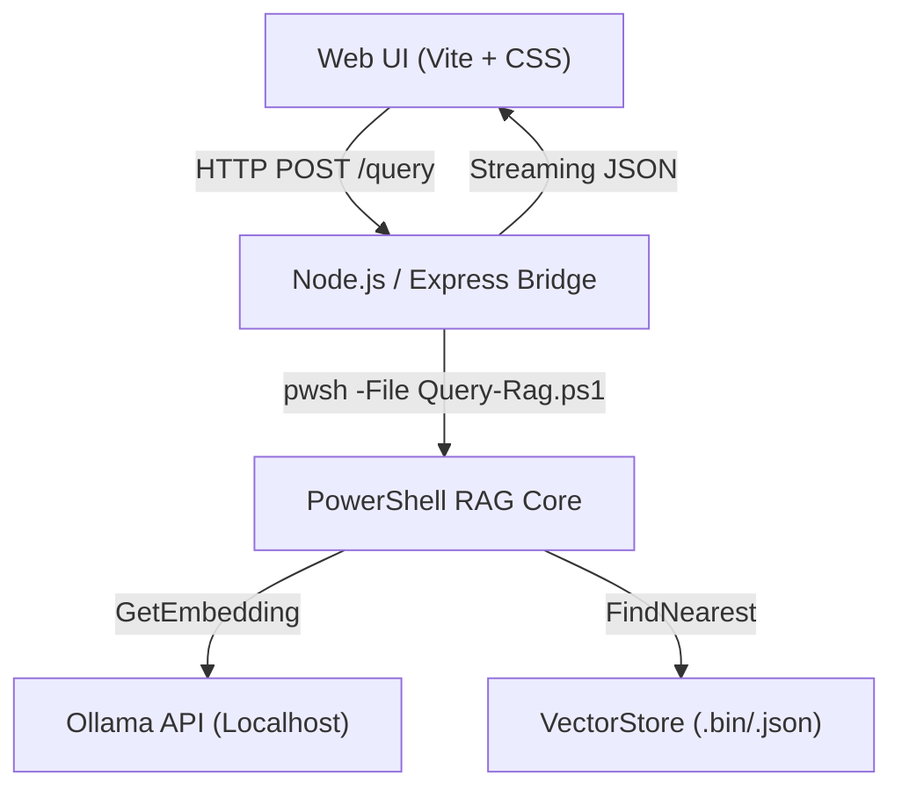

# Phase 10: Web Chat UI - Design & Architecture

## Executive Summary

Phase 10 transforms the Local RAG Project from a collection of scripts into a user-friendly, high-performance web application. This phase focuses on creating a "Premium" chat experience with real-time feedback, source citations, and a modern aesthetic.

## 1. Tech Stack Decisions

### 1.1 Frontend: Vite + Vanilla JS/CSS

- **Reasoning**: High performance, modern development workflow, and strictly follows the "Web Application Development" standards provided.
- **Styling**: Vanilla CSS with custom properties (CSS Variables) for a design system. Glassmorphism and micro-animations for the "WOW" factor.

### 1.2 Backend Bridge: Node.js (Express)

- **Role**: Serves as the API gateway between the browser and the PowerShell RAG logic.
- **Mechanism**: The bridge will execute PowerShell commands using `spawn` for transient queries or re-implement the `OllamaClient` logic in JS while calling `VectorStore` search via a CLI shim (`Query-Rag.ps1 --json`).
- **Streaming**: Enable Server-Sent Events (SSE) or WebSockets to proxy Ollama's streaming responses to the UI.

## 2. UI/UX Requirements

### 2.1 Aesthetic: "Dark Nebula" Design

- **Color Palette**: Deep blacks (`#0B0B0B`), charcoal gray, and vibrant accent colors (Electric Blue/Purple).
- **Glassmorphism**: Translucent sidebars and message bubbles with `backdrop-filter: blur()`.
- **Typography**: "Inter" or "Outfit" (Google Fonts) for a premium tech feel.

### 2.2 Functional Features

- **Streaming Content**: Real-time word-by-word display.
- **Source Citations**: Clickable cards at the bottom of a response showing which files were used as context.
- **Model Toggle**: Dropdown to switch between `Llama3`, `Mistral`, or `Phi3` dynamically.
- **Session Persistence**: LocalStorage for conversation history.

## 3. Architecture Diagram

## 4. Implementation Steps

1.  **Step 10.1: Project Scaffolding**: Setup Vite + Express in a `gui/` subdirectory.
2.  **Step 10.2: API Bridge**: Build the endpoint that executes `Query-Rag.ps1` and parses JSON output.
3.  **Step 10.3: Layout & Design**: Create the responsive sidebar/main chat layout with CSS animations.
4.  **Step 10.4: Integration**: Connect the message input to the bridge and handle streaming/UI states (Loading/Error).
5.  **Step 10.5: Polish**: Add source citation cards and "Smooth Reveal" animations for new messages.

## 5. Potential Constraints

- **Cold Start**: Running a new PowerShell process per query might add 0.5s-1s lag.
- **Mitigation**: If lag is unacceptable, we will look into a persistent PowerShell execution server (Pode) or a Python/FastAPI bridge using `pythonnet` to keep classes warm. (MVP will start with `spawn`).

## 6. Error Handling & Edge Cases

### 6.1 Backend (Node.js Bridge)

- **Ollama Connection Failure**:
  - _Edge Case_: Ollama service is stopped or port 11434 is blocked.
  - _Solution_: The bridge must perform a `/api/tags` health check on startup and provide a clear JSON error to the frontend if down.
- **PowerShell Execution Errors**:
  - _Edge Case_: Script fails due to file locks or invalid collection name.
  - _Solution_: Capture `stderr` from the `spawn` process and return a 500 status with the cleaned-up error message.
- **Timeout Management**:
  - _Edge Case_: Embedding generation or retrieval takes >30s.
  - _Solution_: Set a hard socket timeout of 60s and return a "Request Timed Out" UI message.

### 6.2 Frontend (Web UI)

- **Empty Search Results**:
  - _Edge Case_: No vectors meet the `MinScore` threshold.
  - _Solution_: Display a subtle notification: "No relevant local documents found for this specific query. Answering with general knowledge."
- **Stream Interruptions**:
  - _Edge Case_: Network blip during a long response.
  - _Solution_: Maintain the partial message in the UI and show a "Connection Interrupted" warning with a "Retry" button.
- **Concurrent Requests**:
  - _Edge Case_: User clicks 'Send' multiple times before the first finishes.
  - _Solution_: Disable the input field and show a "Thinking..." spinner during active generation.

### 6.3 AI & RAG Logic

- **Hallucination Control**:
  - _Edge Case_: Context refers to "File A" but AI says "File B".
  - _Solution_: The bridge will re-verify that the returned citations match the filenames passed in the context before displaying them.
- **VRAM Overload**:
  - _Edge Case_: User tries to load a 70B model on a 8GB GPU.
  - _Solution_: Catch the "Insufficient resources" error from Ollama's response and suggest switching to a smaller model (e.g., Phi3).

## 7. Performance Optimization

- **Persistent Shell**: As mentioned in Step 5, we will evaluate using a long-running Node-to-PowerShell bridge to avoid the 0.5s overhead of starting `pwsh.exe` for every query.
- **Caching**: Cache embeddings for the last 5 unique queries to allow instant "back-and-forth" without hitting Ollama's embedding engine.

## 8. System Transparency & Progress Tracking

To ensure the end-user understands exactly what the backend is doing at each step, we will implement a "Process Tracker" in the UI.

### 8.1 Backend Progress Events

The Node.js bridge will emit specific custom events within the SSE stream to signal phase changes:

- `type: "status", message: "🔍 Embedding query..."`
- `type: "status", message: "📁 Searching local vector store..."`
- `type: "status", message: "🧠 Synthesizing response from 5 sources..."`

### 8.2 Frontend Implementation

- **Step Indicator**: Above the AI message bubble, a small status tracker will show the current backend step with a spinner.
- **Detailed Log**: An optional "Debug Console" or "System View" in the sidebar to see the raw retrieval scores and PowerShell execution time.
- **Source Citations**: Improve citation cards to show _why_ they were selected (e.g., "Relevance: 92%").

### 8.3 Context Awareness

- **Model Validation**: The UI will prevent users from selecting non-chat models (like embeddings) for message generation, with a clear tool-tip.
- **Empty State Guidance**: If zero documents are found, provide deep links back to the `Ingest-Documents.ps1` workflow.
