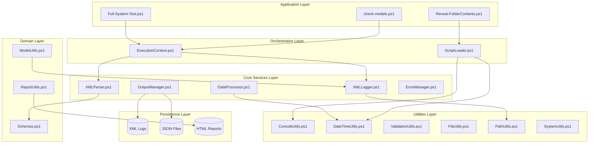

# Project Architecture Analysis

## Executive Summary

The **Local-RAG-Project-v2** is a **modular, layered PowerShell utility suite** designed for AI model monitoring, XML-based structured logging, and automated report generation. It does **not** follow microservice patterns but instead implements a well-structured **library/framework architecture** with clear separation of concerns.

---

## Architectural Pattern: **Modular Library Architecture**

| Aspect            | Classification                                  |
| ----------------- | ----------------------------------------------- |
| **Style**         | Modular / Framework                             |
| **Paradigm**      | Object-Oriented PowerShell (Class-based)        |
| **Coupling**      | Loose (dependency injection via `ScriptLoader`) |
| **Persistence**   | File-based XML/JSON/CSV (no database)           |
| **Microservices** | ❌ Not present                                  |
| **Monolithic**    | ❌ Not monolithic (clear module boundaries)     |

---

## Layered Architecture Diagram



---

## Layer Breakdown

### 1. **Utilities Layer** (Foundation)

_Foundational utilities with zero cross-dependencies_

| Module                | Responsibility                               | Maturity  |
| --------------------- | -------------------------------------------- | --------- |
| `ConsoleUtils.ps1`    | Standardized console output, colors, headers | ✅ Mature |
| `DateTimeUtils.ps1`   | Timestamp formatting, performance timing     | ✅ Mature |
| `ValidationUtils.ps1` | Input validation, error collection           | ✅ Mature |
| `FileUtils.ps1`       | File operations, size formatting             | ✅ Mature |
| `PathUtils.ps1`       | Path management, contextual pathing          | ✅ Mature |
| `SystemUtils.ps1`     | System info collection (OS, CPU, RAM)        | ✅ Mature |

### 2. **Core Services Layer** (Business Logic)

_Core processing and logging infrastructure_

| Module              | Responsibility                            | Maturity  |
| ------------------- | ----------------------------------------- | --------- |
| `XMLLogger.ps1`     | Structured XML log creation               | ✅ Mature |
| `XMLParser.ps1`     | Schema-aware XML parsing                  | ✅ Mature |
| `DataProcessor.ps1` | Filter/Transform/Validate pipelines       | ✅ Mature |
| `OutputManager.ps1` | Multi-format serialization (JSON/XML/CSV) | ✅ Mature |
| `ErrorManager.ps1`  | Centralized error collection              | ✅ Mature |

### 3. **Domain Layer** (Business Domain)

_AI model monitoring and reporting specific functionality_

| Module            | Responsibility                       | Maturity  |
| ----------------- | ------------------------------------ | --------- |
| `ModelUtils.ps1`  | Ollama AI model detection/management | ✅ Mature |
| `ReportUtils.ps1` | Report generation (text, HTML)       | ✅ Mature |
| `Schemas.ps1`     | XML schema registry and detection    | ✅ Mature |

### 4. **Orchestration Layer** (Coordination)

_Cross-cutting concerns and dependency management_

| Module                 | Responsibility                         | Maturity  |
| ---------------------- | -------------------------------------- | --------- |
| `ExecutionContext.ps1` | Performance tracking, phase management | ✅ Mature |
| `ScriptLoader.ps1`     | Dependency injection, utility loading  | ✅ Mature |

---

## Persistence Strategy

### Current Implementation: **File-Based Persistence**

```
Logs/
├── *.xml                    # Structured XML logs
├── *.json                   # JSON exports
├── *.csv                    # Tabular exports
└── Reports/
    └── *.html               # Interactive HTML dashboards
```

| Format   | Use Case                             | Generated By                 |
| -------- | ------------------------------------ | ---------------------------- |
| **XML**  | Primary log storage, structured data | `XMLLogger`, `OutputManager` |
| **JSON** | Data interchange, compact storage    | `OutputManager`              |
| **CSV**  | Spreadsheet compatibility            | `OutputManager`              |
| **HTML** | Interactive dashboards               | `ReportUtils`                |

> [!NOTE]
> **No database persistence exists.** The README mentions planned future enhancements for SQLite/PostgreSQL integration, but this has not been implemented.

---

## Design Patterns Employed

| Pattern                  | Implementation                        | Location                                                                                                                                                                                                                                                     |
| ------------------------ | ------------------------------------- | ------------------------------------------------------------------------------------------------------------------------------------------------------------------------------------------------------------------------------------------------------------ |
| **Factory**              | `XMLLogger::NewWithCentralizedPath()` | [XMLLogger.ps1](file:///c:/Users/Owner/Local-Rag-Project-v2/Local-RAG-Project-v2/PowerShell%20Scripts/XMLLogger.ps1)                                                                                                                                         |
| **Strategy**             | `SchemaRegistry.DetectSchema()`       | [Schemas.ps1](file:///c:/Users/Owner/Local-Rag-Project-v2/Local-RAG-Project-v2/PowerShell%20Scripts/Schemas.ps1)                                                                                                                                             |
| **Template Method**      | `BaseProcessor`, `BaseFormatter`      | [DataProcessor.ps1](file:///c:/Users/Owner/Local-Rag-Project-v2/Local-RAG-Project-v2/PowerShell%20Scripts/DataProcessor.ps1), [OutputManager.ps1](file:///c:/Users/Owner/Local-Rag-Project-v2/Local-RAG-Project-v2/PowerShell%20Scripts/OutputManager.ps1)   |
| **Registry**             | `SchemaRegistry` global instance      | [Schemas.ps1](file:///c:/Users/Owner/Local-Rag-Project-v2/Local-RAG-Project-v2/PowerShell%20Scripts/Schemas.ps1)                                                                                                                                             |
| **Dependency Injection** | `ScriptLoader` profiles               | [ScriptLoader.ps1](file:///c:/Users/Owner/Local-Rag-Project-v2/Local-RAG-Project-v2/PowerShell%20Scripts/ScriptLoader.ps1)                                                                                                                                   |
| **Error Collector**      | `ErrorManager`, `ValidationHelper`    | [ErrorManager.ps1](file:///c:/Users/Owner/Local-Rag-Project-v2/Local-RAG-Project-v2/PowerShell%20Scripts/ErrorManager.ps1), [ValidationUtils.ps1](file:///c:/Users/Owner/Local-Rag-Project-v2/Local-RAG-Project-v2/PowerShell%20Scripts/ValidationUtils.ps1) |

---

## Dependency Graph

All scripts use **dot-sourcing** for dependency loading. The canonical dependency order is:

```
PathUtils.ps1        (Foundation - no deps)
     ↓
ConsoleUtils.ps1     (No deps)
DateTimeUtils.ps1    (No deps)
ValidationUtils.ps1  (No deps)
FileUtils.ps1        (No deps)
SystemUtils.ps1      (No deps)
     ↓
XMLLogger.ps1        (Depends on PathUtils)
     ↓
Schemas.ps1          (No deps)
     ↓
XMLParser.ps1        (Depends on XMLLogger, Schemas, all Utils)
     ↓
ModelUtils.ps1       (Depends on XMLLogger)
ReportUtils.ps1      (Depends on XMLParser)
DataProcessor.ps1    (Depends on DateTimeUtils)
OutputManager.ps1    (No deps - standalone)
ErrorManager.ps1     (No deps - standalone)
ExecutionContext.ps1 (Depends on XMLLogger, DateTimeUtils, ConsoleUtils)
```

---

## Strengths

1. **Clean Separation** - Each module has a single, clear responsibility
2. **OOP in PowerShell** - Effective use of classes, inheritance, and static methods
3. **Graceful Degradation** - Utilities check for dependencies and continue without them
4. **Standardized Output** - Consistent logging, error handling, and console formatting
5. **Schema Extensibility** - New log formats can be added via `Schemas.ps1`

## Architectural Risks

1. **No Database** - All persistence is file-based; scaling or querying will be challenging
2. **Global State** - `$Global:SchemaRegistry` introduces shared mutable state
3. **No Async Support** - All operations are synchronous; long operations block
4. **Dot-sourcing Overhead** - Each script re-loads utilities rather than true module imports
