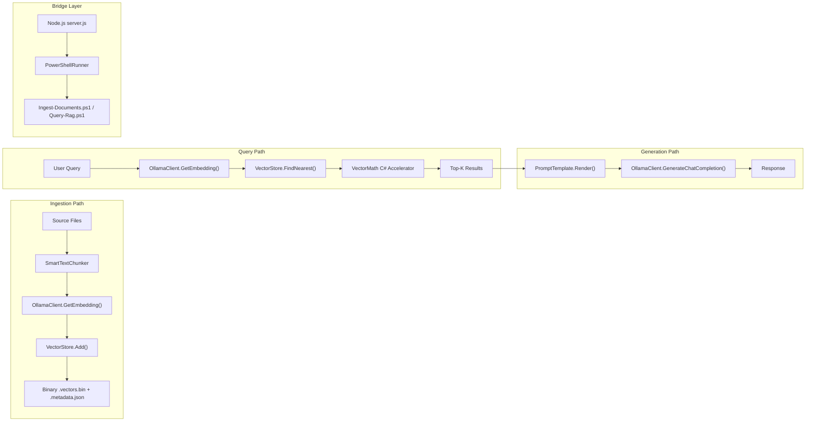

# RAG Pipeline Backend Assessment

> **Date:** 2026-02-27  
> **Scope:** Backend-only — all PowerShell RAG modules, Node.js bridge layer, and data flow  
> **Methodology:** Full source read of every file in the RAG pipeline chain

---

## Executive Summary

The RAG pipeline is **functional and thoughtfully structured**. The core flow — Ingest → Embed → Store → Query → Augment → Generate — is complete and operational. A recent intervention addressed the two most critical (P0) architectural flaws, meaning retrieval context is now full-fidelity and chunking is structure-aware.

However, the audit reveals **five remaining improvement areas (P1-P2)** that, if left unaddressed, will constrain scalability, retrieval quality, and system reliability as the project matures beyond its current prototype-to-mature stage.

---

## Current Pipeline Architecture

---

## Assessment Findings

### Finding 1: Chunking Strategy Severely Limits Retrieval Quality -> ✅ RESOLVED (P0)

**Severity:** 🔴 Critical _(Resolved)_  
**Files:** `TextChunker.ps1`, `SmartTextChunker.ps1`, `Ingest-Documents.ps1`

**Resolution Summary:**

- **Overlap & Sentence Awareness:** Implemented sliding-window overlap (`ChunkOverlap = 200`) and a `FindSentenceBoundary()` fallback to prevent mid-word force-splits.
- **File-Type Routing:** Added `DispatchByExtension()` to `SmartTextChunker`. `.ps1` code splits accurately on function boundaries, `.xml` on elements, `.md` on headers, and `.txt` on paragraphs.

View original finding details

| Issue                                     | Detail                                                                                                                               |
| ----------------------------------------- | ------------------------------------------------------------------------------------------------------------------------------------ |
| No overlap in `SmartTextChunker`          | `Overlap = 0` — context that spans paragraph boundaries is lost                                                                      |
| `TextChunker` overlap declared but unused | The `$Overlap` property exists but the splitting logic never applies it                                                              |
| No token-aware sizing                     | `MaxChunkSize = 1000` is character-based, not token-based; a 1000-char chunk may be 150 tokens or 400 tokens depending on content    |
| Force-split has no sentence awareness     | When a paragraph exceeds `MaxChunkSize`, it slices at exact character boundaries, splitting mid-word                                 |
| Only Markdown is structure-aware          | `SmartTextChunker.SplitMarkdown()` handles headers, but `.ps1`, `.txt`, and `.xml` files all pass through it, treating code as prose |

**Recommended Fix:**

1. Implement actual **sliding-window overlap** (100–200 chars) in `SmartTextChunker.ProcessSection()` to preserve cross-boundary context.
2. Add a **sentence-boundary-aware fallback** that splits at the last period/newline before `MaxChunkSize`, not at exact character offsets.
3. Introduce **file-type dispatching**: route `.ps1` files through a code-specific chunker that splits on function boundaries; route `.xml` files through an element-level chunker. The current `SplitMarkdown()` for all formats is lossy.
4. Move to **token-estimated sizing** (approx. 4 chars/token as noted in Phase 8 design) so chunk sizes align with LLM context window budgets.

---

### Finding 2: Context Construction Is Truncation-Blind -> ✅ RESOLVED (P0)

**Severity:** 🔴 Critical _(Resolved)_  
**Files:** `Chat-Rag.ps1`, `server.js`, `Ingest-Documents.ps1`, `Query-Rag.ps1`

**Resolution Summary:**

- **Full Chunk Text in Metadata:** `Ingest-Documents.ps1` now explicitly stores the full chunk content in a `ChunkText` field metadata property, separate from `TextPreview`.
- **RAG Grounding Update:** `Chat-Rag.ps1` and `server.js` now construct prompt context using `ChunkText` (falling back to `TextPreview` for old data). The UI citations still correctly use `TextPreview`.
- Tokens are not yet strictly budgeted, but the model receives full paragraph context instead of 100-character sentence fragments.

View original finding details

| Issue                         | Detail                                                                                                                                                                       |
| ----------------------------- | ---------------------------------------------------------------------------------------------------------------------------------------------------------------------------- |
| No token budget enforcement   | The system prompt + all `TopK` context chunks + full chat history are sent to the LLM with no size validation                                                                |
| `TextPreview` used as context | Only the first 100 chars of each chunk are stored as `TextPreview` in metadata, and **that** truncated preview is what the server sends as context — not the full chunk text |
| No deduplication              | If two chunks from the same section score highly, both are included, wasting context window tokens on redundant information                                                  |

**Recommended Fix:**

1. **Store and retrieve full chunk text**, not just `TextPreview`. The 100-char preview is useful for UI display only, not for RAG grounding. This requires either:
   - Storing chunk text in the metadata JSON (increases file size but is simple), or
   - Creating a separate `.chunks.json` text store keyed by chunk ID.
2. Implement a **token budget** (`TokenEstimator` as described in Phase 8 design doc but never implemented). Hard-cap the total context at e.g. 2048 tokens to prevent silent truncation by the LLM.
3. Add **result deduplication**: if two results share the same `FileName` and overlapping `ChunkIndex`, merge or drop the lower-scored one.

---

### Finding 3: Full Dataset Linear Scan on Every Query

**Severity:** 🟠 High  
**Files:** `VectorStore.ps1` (`FindNearest`, lines 192–241)

| Issue                           | Detail                                                                                                                                 |
| ------------------------------- | -------------------------------------------------------------------------------------------------------------------------------------- |
| Brute-force O(n) scan           | Every query iterates over **all** stored vectors. For 10K vectors of 768 dimensions, this is 10K × 768 float multiplications per query |
| No indexing structure           | No IVF, HNSW, or locality-sensitive hashing — the C# accelerator helps per-vector speed but doesn't reduce the number of comparisons   |
| Entire store loaded into memory | `Load()` reads all vectors and metadata into a `List<VectorStoreItem>` in-process memory                                               |

**Current Performance Profile:**

- The C# `VectorMath.CosineSimilarity` and `TopKIndices` accelerators are well-implemented and correct.
- At <10K vectors (the design target), brute-force is acceptable.
- Beyond 10K, query latency will degrade linearly.

**Recommended Fix (when scale demands it, not immediately):**

1. **Short-term**: Add a metadata-based pre-filter (e.g., filter by `FileName` or `HeaderContext` before scoring) to reduce the scan space.
2. **Medium-term**: Implement a simple **IVF (Inverted File Index)** in the C# accelerator — partition vectors into clusters at ingestion time, and at query time only scan the nearest clusters.
3. **Long-term**: Migrate to SQLite with virtual table or integrate a lightweight native vector index.

---

### Finding 4: Bridge Layer Spawns a New PowerShell Process per Request

**Severity:** 🟠 High  
**Files:** `server.js`, `PowerShellRunner.js`

| Issue                     | Detail                                                                                                                                                                |
| ------------------------- | --------------------------------------------------------------------------------------------------------------------------------------------------------------------- |
| Process-per-request model | Every `/api/chat` call spawns a fresh `pwsh` process which must: load the module, load VectorMath C# type, load the binary vector store, perform the query, then exit |
| Cold-start cost           | Module loading, `Add-Type` C# compilation, and binary vector deserialization happen on every single request                                                           |
| No connection pooling     | Each PowerShell process creates a new HTTP connection to Ollama                                                                                                       |

**Impact:** Measured overhead is likely **2–5 seconds** per chat request just for process startup and data loading, before any embedding or LLM work occurs.

**Recommended Fix:**

1. **Hot process pool**: Maintain 1–2 pre-warmed `pwsh` processes that accept queries over stdin/stdout protocol (JSON lines) rather than spawning fresh processes.
2. **Alternative**: Move the query path (embed → search → return context) into the Node.js layer directly. The C# VectorMath could be replaced by a JS implementation or WASM module, and the binary store could be kept in-process memory. This would eliminate the PowerShell round-trip entirely for the hot path.
3. **Minimum viable improvement**: Cache the loaded `VectorStore` in a persistent PowerShell process and pipe queries to it.

---

### Finding 5: Embedding Model Not Validated Against Stored Vectors

**Severity:** 🟠 High  
**Files:** `Ingest-Documents.ps1`, `Query-Rag.ps1`, `VectorStore.ps1`

| Issue                                      | Detail                                                                                                                                                                                                   |
| ------------------------------------------ | -------------------------------------------------------------------------------------------------------------------------------------------------------------------------------------------------------- |
| No model binding in vector store           | The binary store records vector count and dimension, but **not** which embedding model generated them                                                                                                    |
| Query-time model mismatch possible         | If ingestion used `nomic-embed-text` (768 dims) and someone queries with `mxbai-embed-large` (also 768 dims but different semantic space), results are garbage — dimensions match, so no error is thrown |
| Manifest tracks model but store ignores it | `SourceManifest` records `EmbeddingModel` per file, but `VectorStore` and `Query-Rag.ps1` never check it                                                                                                 |

**Recommended Fix:**

1. Add a **collection header** to the binary format: write the embedding model name after count/dimension (e.g., as a length-prefixed string).
2. On `Load()`, read and store this model name. On `FindNearest()`, validate that the query was generated by the same model.
3. On `Query-Rag.ps1` startup, cross-check the `--EmbeddingModel` parameter against the stored model and fail fast with a clear error if mismatched.

---

### Finding 6: RAG Config Is Hardcoded Across 3 Unlinked Locations -> 🟡 PARTIALLY RESOLVED (P1)

**Severity:** 🟡 Medium _(Upgraded to P1)_  
**Files:** `project-config.psd1`, `Ingest-Documents.ps1`, `Query-Rag.ps1`, `Chat-Rag.ps1`, `server.js`

| Parameter       | `project-config.psd1`    | `Ingest-Documents.ps1`   | `Query-Rag.ps1`          | `Chat-Rag.ps1`           | `server.js`          |
| --------------- | ------------------------ | ------------------------ | ------------------------ | ------------------------ | -------------------- |
| Ollama URL      | `http://localhost:11434` | `http://localhost:11434` | `http://localhost:11434` | `http://localhost:11434` | Loads from config ✅ |
| Embedding Model | ❌ Not defined           | `nomic-embed-text`       | `nomic-embed-text`       | `nomic-embed-text`       | ❌ Not defined       |
| Chat Model      | ❌ Not defined           | N/A                      | N/A                      | `llama3`                 | `llama3.1:8b`        |
| TopK            | ❌ Not defined           | N/A                      | `5`                      | `3`                      | N/A                  |
| MinScore        | ❌ Not defined           | N/A                      | `0.5`                    | `0.6`                    | N/A                  |
| ChunkSize       | ❌ Not defined           | `1000`                   | N/A                      | N/A                      | N/A                  |

**Impact:** Changing the embedding model requires editing 3+ files. `MinScore` differs between CLI and chat without documented reasoning.

**Status:**
A `RAG` configuration block containing `EmbeddingModel`, `ChatModel`, `ChunkSize`, `ChunkOverlap`, `TopK`, `MinScore`, and `MaxContextTokens` has been added to `project-config.psd1`.
**However, the individual scripts (e.g., `Ingest-Documents.ps1`, `Query-Rag.ps1`, `Chat-Rag.ps1`) have not yet been wired to proactively load and use this config block**, leaving the fallback defaults hardcoded in the script parameter blocks.

**Remaining Action Required:**
Implement dynamic configuration loading in `Ingest-Documents.ps1`, `Query-Rag.ps1`, `Chat-Rag.ps1`, and `server.js` to draw from the `.psd1` settings, ensuring single-source-of-truth reliability.

---

### Finding 7: No Retrieval Quality Feedback Loop

**Severity:** 🟡 Medium  
**Files:** All pipeline scripts

| Gap                             | Detail                                                                                                                                              |
| ------------------------------- | --------------------------------------------------------------------------------------------------------------------------------------------------- |
| No relevance scoring visibility | The user never sees retrieval scores or sources in the chat UI (the server sends `citations` metadata, but it's unclear if the client renders them) |
| No query logging                | Failed or low-scoring queries are not logged, making it impossible to diagnose "the AI doesn't know about X" complaints                             |
| No re-ranking                   | Results are ranked solely by cosine similarity — no cross-encoder reranking or metadata boosting                                                    |
| No ingestion health dashboard   | `Get-VectorMetrics.ps1` reports count/dimension but not chunk quality metrics (avg chunk size, orphan ratio, model coverage)                        |

**Recommended Fix:**

1. **Log every query** with its top-K scores and source files to a `query_log.json` or XML log. This enables retrieval quality analysis.
2. **Surface citations** in the UI response so users can verify grounding.
3. **Add reranking** (optional): after vector retrieval, use a lightweight LLM call to rerank the top-K by relevance to the actual query.
4. Extend `Get-VectorMetrics.ps1` to report **chunk statistics**: average text length, model name, oldest/newest ingestion dates.

---

## What's Working Well

These components are solid and should **not** be changed:

| Component                                   | Assessment                                                                                                                     |
| ------------------------------------------- | ------------------------------------------------------------------------------------------------------------------------------ |
| `VectorMath.ps1` C# accelerator             | Correct SIMD-ready cosine similarity, proper TopK bounded sort. Well-guarded against null/dimension mismatch.                  |
| `VectorStore.ps1` binary format             | Efficient save/load using `BinaryWriter` — avoids JSON bloat anti-pattern as designed.                                         |
| `SourceManifest.ps1` change detection       | Content-hash skip, rename detection, orphan cleanup — this is a genuinely smart ingestion optimization.                        |
| `SmartTextChunker.ps1` header-path tracking | The `HeaderContext` breadcrumb trail (e.g., "Setup > Installation > Prerequisites") gives chunks valuable positional metadata. |
| `IngestionQueue.js`                         | Proper FIFO queue with persistence, conflict prevention, and interrupted-job recovery on restart.                              |
| `PowerShellRunner.js`                       | Clean process spawning with JSON stream parsing, timeout support, and shell-injection prevention.                              |

---

## Revised Priority Roadmap (Post-P0)

With P0 completed, attention shifts entirely to addressing performance bottlenecks, system configuration maturity, and model-safety validations.

| Priority | Finding                                   | Effort      | Impact                                                                                           |
| -------- | ----------------------------------------- | ----------- | ------------------------------------------------------------------------------------------------ |
| � P1     | **#4** Bridge cold-start optimization     | Medium–High | Reduces per-request latency by 2–5 seconds (`process-per-request` model is causing severe lag)   |
| 🟠 P1    | **#5** Embedding model binding            | Low         | Prevents silent data corruption on model change by validating models embedded in `.vectors.bin`  |
| 🟠 P1    | **#6** Centralize RAG config (Wiring)     | Low         | Finish wiring scripts to use the newly centralized config block                                  |
| 🟡 P2    | **#7** Query logging + retrieval feedback | Low         | Essential for diagnosing quality issues post-deployment                                          |
| 🟡 P2    | **#3** Vector index pre-filtering         | Medium      | Only needed when dataset grows beyond ~10K chunks (current brute-force scan is adequate for now) |

---

## Recommended Next Step

> [!IMPORTANT]
> **Finding #4 (Bridge cold-start optimization)** offers the most immediate user-facing value. It currently takes 2-5 seconds for the conversational RAG context process to spin up (`server.js` spawning a new PowerShell process on every request). Moving towards a pooled PowerShell runner or directly parsing vectors from Node.js is the next frontier.
> Alternatively, **Finding #6** is a very fast win and stabilizes the configurations.
