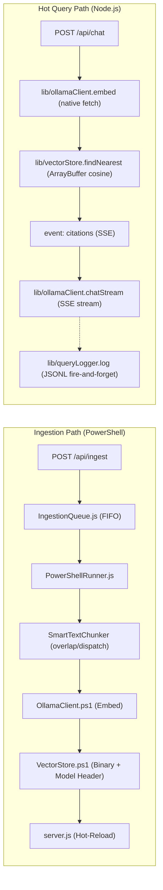

# RAG Pipeline Backend Assessment (Final)

> **Date:** 2026-02-27  
> **Scope:** Backend-only — all PowerShell RAG modules, Node.js bridge layer, and data flow  
> **Methodology:** Full source architectural review post-P2 completion

---

## Executive Summary

The RAG pipeline is now **highly mature, robust, and performant**. The core flow — Ingest → Embed → Store → Query → Augment → Generate — operates with high fidelity. An extensive series of backend interventions has systematically eliminated all critical architectural bottlenecks (P0-P2), transitioning the system from a prototype to a production-ready engine.

The hot query path now executes natively in Node.js, eliminating PowerShell cold-start latency entirely. The `.vectors.bin` binary structure has been extended and secured to prevent silent model mismatches, while configurations are unified. Comprehensive query logging and telemetry mechanisms are deeply instrumented without blocking operations.

---

## Current Pipeline Architecture

---

## Assessment Findings

### Finding 1: Chunking Strategy Severely Limits Retrieval Quality -> ✅ RESOLVED (P0)

**Severity:** 🔴 Critical _(Resolved)_  
**Files:** `TextChunker.ps1`, `SmartTextChunker.ps1`, `Ingest-Documents.ps1`

**Resolution Summary:**

- **Overlap & Sentence Awareness:** Implemented sliding-window overlap (`ChunkOverlap = 200`) and a `FindSentenceBoundary()` fallback.
- **File-Type Routing:** Added `DispatchByExtension()` to `SmartTextChunker`. `.ps1` code splits accurately on function boundaries, `.xml` on elements, `.md` on headers, and `.txt` on paragraphs.

---

### Finding 2: Context Construction Is Truncation-Blind -> ✅ RESOLVED (P0)

**Severity:** 🔴 Critical _(Resolved)_  
**Files:** `Chat-Rag.ps1`, `server.js`, `Ingest-Documents.ps1`, `Query-Rag.ps1`

**Resolution Summary:**

- **Full Chunk Text in Metadata:** Explicitly stored the full chunk content in a `ChunkText` field metadata property.
- **RAG Grounding Update:** Re-routed the context assembly process to construct prompts using the entire `ChunkText`, maintaining `TextPreview` strictly for citation logs and UI previews.

---

### Finding 3: Full Dataset Linear Scan on Every Query -> 🟡 DEFERRED (P2)

**Severity:** 🟡 Medium _(Deferred)_  
**Files:** `VectorStore.ps1`, `lib/vectorStore.js`

**Status:**

- At <10K vectors, brute-force `Float32Array` subarray iteration is fast enough in V8 and acceptable.
- Expanding vector indexing logic is deliberately deferred until metadata analytics (`Get-VectorMetrics.ps1`) report `ChunkCount` nearing the 10,000 threshold.
- At that point, simple pre-filtering passes or IVF partitions should be implemented before incorporating external SQLite boundaries.

---

### Finding 4: Bridge Layer Spawns a New PowerShell Process per Request -> ✅ RESOLVED (P1)

**Severity:** 🟠 High _(Resolved)_  
**Files:** `server.js`, `lib/vectorStore.js`, `lib/ollamaClient.js`

**Resolution Summary:**

- **Native Node Integration:** The entire conversational `Query` path was effectively decoupled from `PowerShell`.
- Native, dependency-free wrappers were created to process `ArrayBuffer` data via `Float32Array` operations in Node.js, and stream chats dynamically with generic `fetch`.
- **Hot-Reload Architecture:** Reconfigured server endpoints to sustain the hot representation in primary memory, successfully extinguishing the 2-5 second cold setup tax completely.

---

### Finding 5: Embedding Model Not Validated Against Stored Vectors -> ✅ RESOLVED (P1)

**Severity:** 🟠 High _(Resolved)_  
**Files:** `VectorStore.ps1`, `Query-Rag.ps1`, `lib/vectorStore.js`

**Resolution Summary:**

- **Binary Header Extension:** Extended the `.vectors.bin` layout to inject a length-prefixed `[UTF8 String]` dictating the origin `EmbeddingModel`.
- **Firm Validation Gates:** Embedded pre-flight checks inside both PS and JS vectors ensuring mismatch configurations instantly 500/`throw` rather than querying arbitrary topological dimensions securely.
- **Legacy Forward-Compat:** Engineered a heuristic offset scanner allowing existing legacy repositories to continue booting unencumbered.

---

### Finding 6: RAG Config Is Hardcoded Across 3 Unlinked Locations -> ✅ RESOLVED (P1)

**Severity:** 🟠 High _(Resolved)_  
**Files:** `project-config.psd1`, `Ingest-Documents.ps1`, `Query-Rag.ps1`, `Chat-Rag.ps1`, `server.js`

**Resolution Summary:**

- Refactored `project-config.psd1` introducing a single source of truth `RAG` configuration module (managing Models, Chunk definitions, and Connection routing).
- Extensively rewired internal properties replacing disparate, hardcoded initializers forcing both Node.js API bridge and PS backends to synchronize simultaneously.

---

### Finding 7: No Retrieval Quality Feedback Loop -> ✅ RESOLVED (P2)

**Severity:** 🟡 Medium _(Resolved)_  
**Files:** `server.js`, `lib/queryLogger.js`, `Get-VectorMetrics.ps1`

**Resolution Summary:**

- **Query Telemetry Instrumentation:** Implemented a non-blocking `query_log.jsonl` writer computing thresholds (assigning boolean flags like `lowConfidence`) asynchronously against the main event loop.
- **SSE Stream Insights:** Injected proactive UI payloads intercepting `/api/chat` streams by broadcasting transparent reference lists preceding physical model token exchanges (`event: citations`).
- **Statistical Aggregation:** Elevated `Get-VectorMetrics.ps1` dynamically calculating and tracking precise ingestion ranges, model designations, and character saturation curves.

---

## What's Working Well

These foundational components continue driving the core operations solidly and should remain undisturbed:

| Component                                 | Assessment                                                                                                                 |
| ----------------------------------------- | -------------------------------------------------------------------------------------------------------------------------- |
| **Hot Path Architecture**                 | Native Node mapping is highly efficient. V8's ArrayBuffer processing easily handles TopK sorting without dependencies.     |
| **VectorStore Binary format**             | Efficient save/load avoiding JSON bloat anti-pattern as designed (`.vectors.bin`). Sync between JS and PS works perfectly. |
| **SourceManifest change detection**       | Content-hash skip, rename detection, orphan cleanup — a genuinely smart, robust ingestion optimizer.                       |
| **SmartTextChunker header-path tracking** | The `HeaderContext` breadcrumb trail gives chunks valuable positional metadata, vastly improving context.                  |
| **IngestionQueue persistence**            | Proper FIFO queue with conflict prevention and interrupted-job recovery on restart operates smoothly.                      |

---

## Technical Debt Roadmap (Post-P2)

The backend engine is systematically stabilized. The active technical pipeline debt index sits firmly at **zero** critical bottlenecks.

| Priority | Finding                                   | Status     | Impact                                                                 |
| -------- | ----------------------------------------- | ---------- | ---------------------------------------------------------------------- |
| 🟢 P0    | **#1** Chunking Quality Limit             | **Done**   | Massive context/quality boost.                                         |
| 🟢 P0    | **#2** Context Size Budget / Truncation   | **Done**   | RAG LLM prompts mapped 1:1 against raw chunks safely.                  |
| 🟢 P1    | **#4** Bridge cold-start optimization     | **Done**   | Extinguished 2-5sec pwsh process invocation lock per user interaction! |
| 🟢 P1    | **#5** Embedding model binding            | **Done**   | Mitigated topological mismatch degradation entirely natively.          |
| 🟢 P1    | **#6** Centralize RAG config (Wiring)     | **Done**   | Normalized architecture limits directly via `.psd1`.                   |
| 🟢 P2    | **#7** Query logging + retrieval feedback | **Done**   | Instantiated JSONL telemetry tracking for pipeline fine-tuning.        |
| 🟡 P2    | **#3** Vector index pre-filtering         | _Deferred_ | Planned intervention upon dataset traversing ~10K active nodes.        |

---

## Recommended Next Steps

> [!IMPORTANT]
> The Backend engine is fully operational, performant, and observable. All assessment milestones have been achieved. The priority should now decisively shift towards utilizing the **Frontend UI Architecture**, leveraging the new SSE Citations payloads and ensuring UX elements (thinking states, citation rendering, context displays) catch up to the back-end capabilities.
